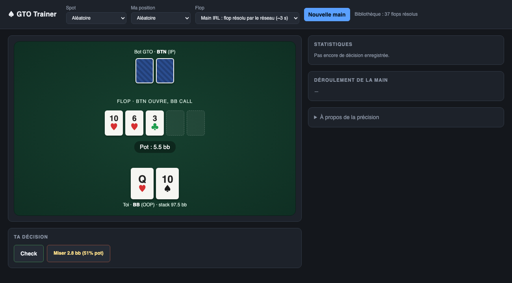
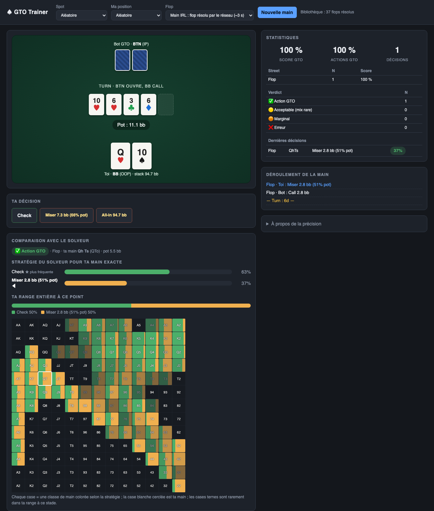

# Poker: GTO trainer + real-time flop solving with a value network

Two things live in this repository:

1. **`gto-trainer/`** — a local web app that plays heads-up NLHE hands against a solver-driven bot and grades each of your
   decisions against solver strategies.
2. **`model/` + `tools/`** — a research track to solve **flops in real time on an Apple Silicon Mac**. Exact solves of
   turn roots (from `postflop-solver`) are distilled into a value network, `net_turn`, which stands in for everything that
   comes after the flop inside a truncated CFR. Design and rationale: [`architecture.md`](architecture.md); working rules:
   [`CLAUDE.md`](CLAUDE.md).

## The trainer

Deal yourself a heads-up hand, decide, and see how your choice compares with the solver: the frequency it plays each action
with your exact hand, and its strategy for your whole range on a 13×13 grid. The bot plays the solver's mixed strategy.
(The interface is in French.)

| Your decision | The comparison with the solver |
|---|---|
|  |  |

Three ways to get the flop (menu at the top):

- **Main IRL**: no precomputation. A random flop is solved on the spot by the value network (about 3 s on an M2): a
  truncated CFR over the flop whose leaves are valued by `net_turn`. Approximate, and limited to the flop game the network
  knows (one 50 % bet, no raise, no all-in).
- **Library**: flops solved beforehand by the exact solver, instant.
- **New flop, exact solver**: solved on demand by `postflop-solver`, 20 to 60 s.

The turn and the river are always solved exactly on the spot (0.1 to 1.7 s) with the ranges narrowed, combo by combo, by the
actions actually played. Details in [`gto-trainer/README.md`](gto-trainer/README.md).

## Where things stand

| | Measured |
|---|---|
| Label generation | exact turn-root solve ≈ 1.5–2.6 s (native solver; TexasSolver ≈ 15–30 s); flop ≈ 40–60 s |
| `net_turn` accuracy (range-weighted MAE, % of pot, held-out flops) | equity baseline 18.6 → DOC 4.6 / SMALL 5.0 / S2 5.6 / TINY 6.1 |
| Real EV loss of the resolved flop strategy (one held-out spot, exact continuation) | SMALL 0.64 %, DOC 0.74 %, TINY 0.92 % of the pot; equity-only leaves 3.11 %; uniform 20.9 % |
| One flop decision, new flop (TINY, 100 CFR iterations, 12 sampled turn cards, Apple M2, the 28 val + 22 test flops of the single-raised matchups) | 2.7 s on average (median 2.7, p90 3.1, max 4.0), against a 0.4 s target; exploitability inside the network's own game 0.38 % of the pot |

The real-EV-loss figure is a single spot and a single run (solver noise ≈ ±0.15 % of the pot), and the strategy frequencies
of the resolver are not validated: after 100 iterations the bet frequency at the root is still 0.17 away from a converged
run (range-weighted), although the strategy is hardly exploitable. Time is proportional to the number of iterations and
dominated by per-operation overhead, not by arithmetic; see `architecture.md` §11–12 for the caveats, what was tried
(pruning hands, `torch.compile`, Core ML, warm starts) and what it gave. The resolver serves the trainer's "Main IRL" mode.

## Layout

| Path | What |
|---|---|
| `gto-trainer/` | Web trainer (stdlib Python + vanilla JS). Solves streets with the vendored postflop-solver (`street_tree`). See its own README (French). |
| `model/gtonet/` | Python package: cards/evaluator/equity, label pipeline, `net_turn`, vector CFR, real-time resolver |
| `model/scripts/` | Data generation, featurisation, training, evaluation, experiment runners |
| `model/tests/` | `unittest` suite (36 tests) |
| `model/checkpoints/` | The small trained nets (TINY, S2, SMALL); the 63 MB DOC nets are not versioned |
| `tools/postflop-solver/` | Vendored Rust solver (AGPL-3.0, see `VENDORED.md`) |
| `tools/turn-labels/` | Rust JSONL front-ends: `turn-labels`, `flop_lines`, `flop_lock`, `street_tree` (the trainer's solver) |
| `tools/boardlib/` | Rust library (C ABI, used through `ctypes`): 7-card strength, win tables, equity |
| `bench/` | Micro-benchmarks and validation experiments (`eval_heldout.py`: held-out timing and exploitability) |
| `docs/img/` | Screenshots of the trainer |

## Requirements

Apple Silicon Mac (training and inference use PyTorch's `mps` backend), Python 3.13, Rust (`brew install rust`).

## Setup

```bash
# 1. Rust tools (postflop-solver is built as a dependency)
(cd tools/turn-labels && cargo build --release)
(cd tools/boardlib && cargo build --release)

# 2. Python environment for the model track and the trainer's "Main IRL" mode (the other trainer modes need only the
#    standard library)
python3 -m venv model/.venv && model/.venv/bin/pip install numpy pyarrow torch

# 3. Preflop range files (the only thing still taken from TexasSolver; see "Planned" below).
#    Download the macOS build of v0.2.0 from https://github.com/bupticybee/TexasSolver and unzip it as
#    ./TexasSolver-v0.2.0-MacOs  (git-ignored; it is a third-party release with its own license).
```

## Running

```bash
cd gto-trainer && ../model/.venv/bin/python server.py   # trainer on http://localhost:8765 (plain python3 works without "Main IRL")

cd model
.venv/bin/python -m unittest discover -s tests          # tests
.venv/bin/python scripts/gen_flops.py --total 300       # native flop solves -> data/native_flops   (hours)
.venv/bin/python scripts/gen_labels.py --n-per-flop 24  # exact turn-root labels -> data/turn_labels (hours)
.venv/bin/python scripts/backfill_v2.py && .venv/bin/python scripts/featurize.py
.venv/bin/python scripts/eval_baseline.py val           # the equity floor to beat
.venv/bin/python scripts/train.py --config small --steps 6000
# evaluation, learning curve, sensitivity, resolver benchmarks: see model/README.md and bench/
```

Generated data (`model/data`, caches, logs) is git-ignored and regenerable; the pipeline is resumable.

## Removing TexasSolver

TexasSolver is no longer a solver dependency: the trainer solves every street with `postflop-solver`
(`tools/turn-labels`' `street_tree`, 0.1–0.6 s per turn/river against 12–15 s, strategies within the native solver's own
run-to-run noise on 8 turn/river spots; the only structural difference is that a re-raise leaving less than 15 % of the
pot behind is an all-in). What is left:

1. **Flop library**: the flops solved by TexasSolver are ignored by the trainer (new profile id); regenerate with
   `gto-trainer/precompute.py` (about 16 s per flop). The model track still reads that old library as one of its two
   flop sources (`gtonet/flopdump.py`, `states.py`); native flop solves (`gen_flops.py`) replace it.
2. **Preflop range files**: `ranges/6max_range` (1483 files) still come from the TexasSolver release folder and define every
   spot. They must be copied into the repository, or replaced, before the folder can go; their provenance and licence
   need checking first.

## License

Not chosen yet. Note that `tools/postflop-solver` is AGPL-3.0-or-later and `tools/turn-labels` links it, so that binary is
subject to the same terms; decide on the repository license before publishing.
